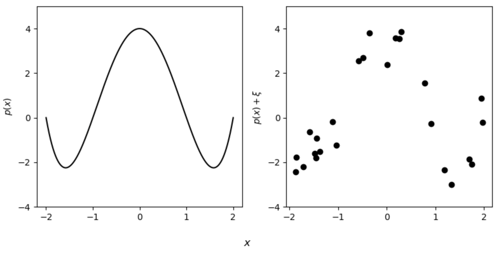
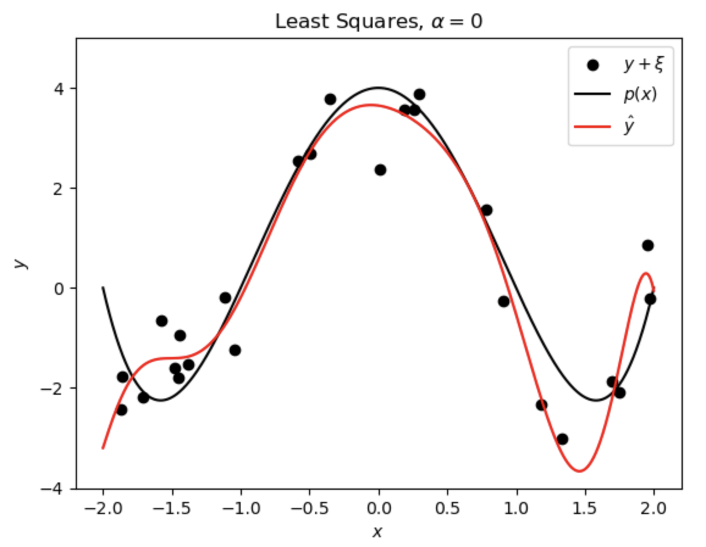
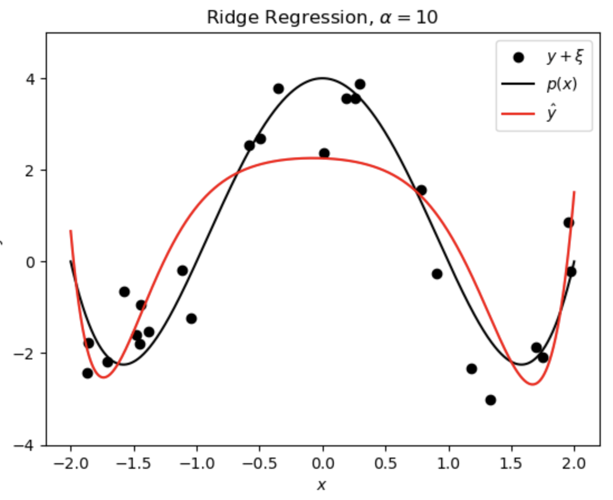
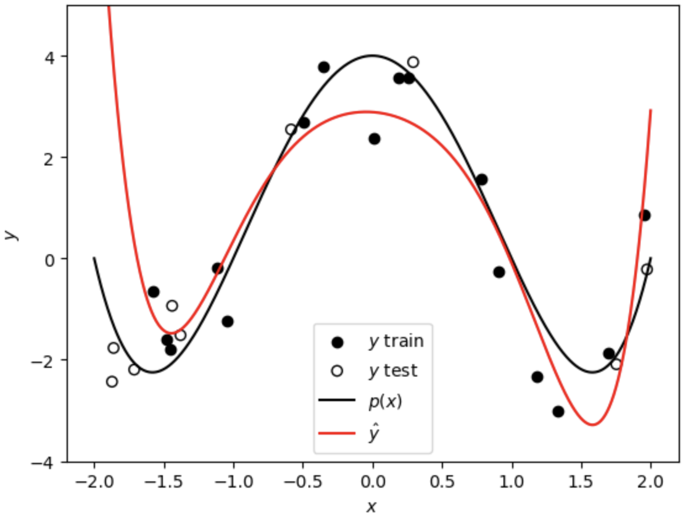
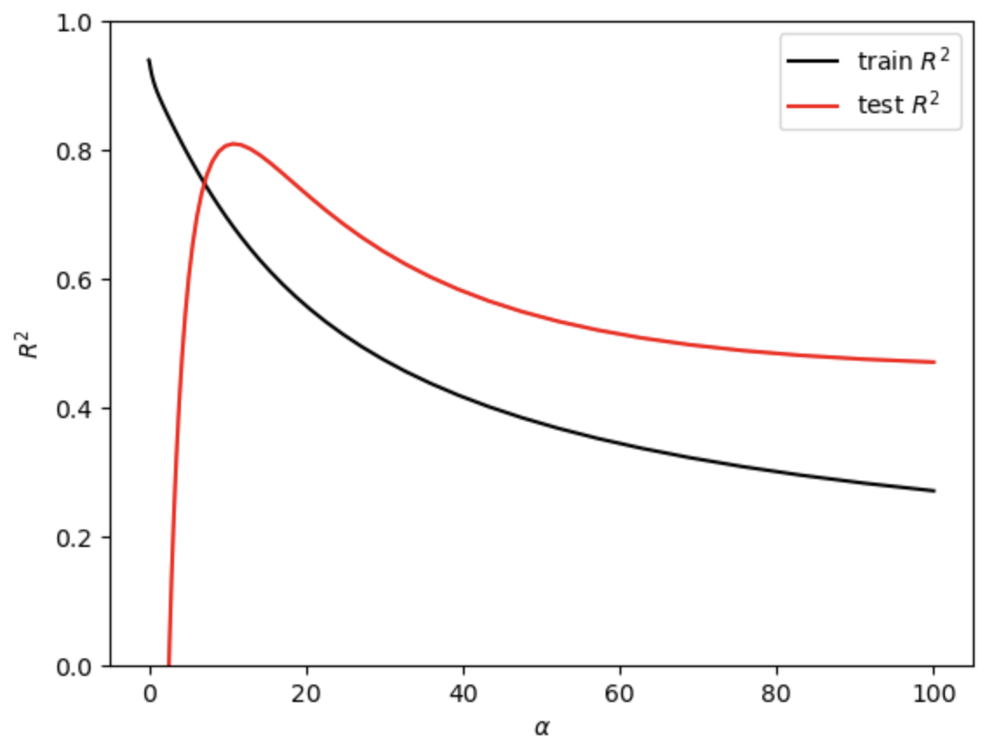
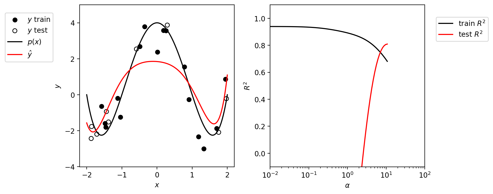

# Ridge_Regression_Visualized
In this repository, I share a nice visual exploration of ridge regression through animations. First, a ground truth low degree polynomial is generated with noise, and the (not so great) least squares fit with a much higher order polynomial is shown. Then, the ridge regression hyperparameter is tuned to make a sparse model with lower variance.

### How to use this codebook
All the code needed for the visualization is found in the polynomial_regularization_vis.py file. It contains all the chunks described below plus some extra descriptions. In the first chunk, you can choose any (preferably low-degree) polynomial as a ground truth model and tune the noise of the generated data.

  

Next, you can compare the least squares fit of a high degree polynomial (typically overfit) with one ridge regression fit, for instance $\alpha=10$. The sklearn ridge regression package solves the optimization problem $\arg\min_{\vec{\beta}} \lbrace \|\|\vec{y} - \mathrm{X}\vec{\beta}\|\|_2 + \alpha\|\|\vec{\beta}\|\|_2 \rbrace$, in other it solves for a parameter vector that minimizes the residuals and the $\ell^2$ norm of the parameter vector $\vec{\beta}$.

  

To explore the ridge fit further, the next chunk allows you to do a train-test split and choose a hyperparameter to try sparsify the high degree polynomial fit.

  

Before generating the animation, you are also able to graph what the train-test $R^2$ looks like when you sweep the $\alpha$ hyperparameter. For this particular polynomial, it looks something like this:

  

In the final chunk, you can run an animation that simulataneously shows how the fit changes when you vary log $(\alpha)$. It generates 100 frames that are saved to your output directory of choice and that you can stitch together with built-in software like QuickTime player. Below is one example of a frame.

  

Please leave a comment if you have any questions or issues! I hope this helps provide a little bit of intuition about how ridge regression works to sparsify models.
